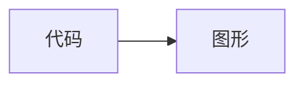

# dsh-mermaid

在 DeepSeek Harness Web 会话中把 Mermaid 围栏代码块渲染为 SVG 图形，并提供“图 / 代码”双向切换。支持流式输出、深色主题和渲染失败后自动回退到代码。

## 特性

- 支持 `mermaid`、`mermaidjs`、`mmd` 围栏代码块
- 兼容 DSH/Shiki plain fallback（代码元素可能没有 language class）
- Mermaid 固定为 `11.17.0` 并打入客户端产物，不依赖运行时 CDN
- 使用 Mermaid `securityLevel: strict`
- 只增强 `<pre><code>` 代码块，不处理行内代码
- 使用渲染 generation 防止流式输出中的旧结果覆盖新结果

## 开发与验证

要求 Node.js 22.19 或更高版本。

```powershell
npm.cmd install
npm.cmd run check
npm.cmd run build
```

构建产物位于 `lib/`，并由 DSH 客户端模块加载器注册为 `dsh-mermaid`。

## 一条命令安装

发布到 npm 后，已全局安装 DSH 的用户运行：

```powershell
dsh plugin --profile web add dsh-mermaid
```

没有全局 `dsh` 命令时，可以直接通过 npm/npx 调用：

```powershell
npx.cmd --yes @deepseek-ai/dsh plugin --profile web add dsh-mermaid
```

DSH 会通过 pnpm 安装包，识别包内的 `dsh.bundle` 声明，并自动把 `dsh-mermaid` 加入 web profile 的 bundles。安装后重启 DSH Web 或刷新页面。

升级：

```powershell
dsh plugin --profile web update dsh-mermaid
```

卸载：

```powershell
dsh plugin --profile web remove dsh-mermaid
```

## 从本地源码安装

在项目目录运行：

```powershell
npm.cmd install
npm.cmd run build
dsh plugin --profile web add .
```

DSH 会把相对路径解析为当前插件项目的绝对路径。也可以手动复制构建后的包到：

```text
C:\Users\<用户名>\.dsh\profiles\web\node_modules\dsh-mermaid
```

不要把整个 `.dsh` 目录提交到 Git，其中可能包含会话和凭据。

## 使用

让模型输出：

````markdown

````

代码块上方会出现“图 / 代码”按钮，默认显示图形。

## 发布检查

```powershell
npm.cmd run check
npm.cmd run build
npm.cmd pack --dry-run
git status --short
git diff --cached
```

## 许可证

[MIT](LICENSE)
